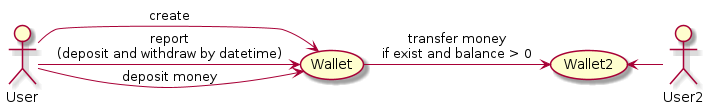
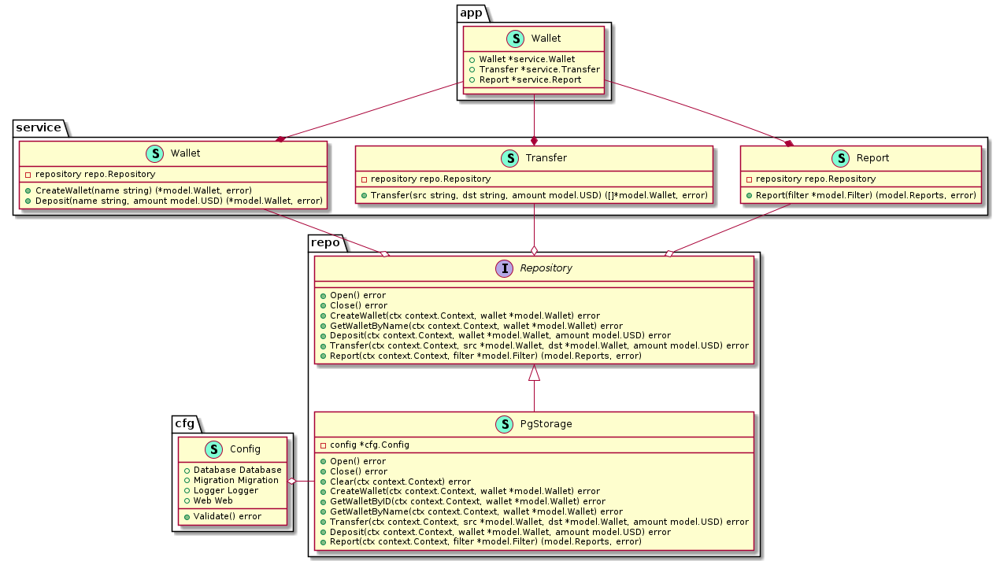
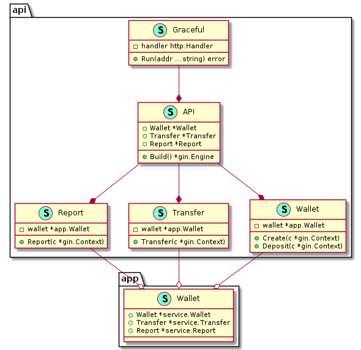
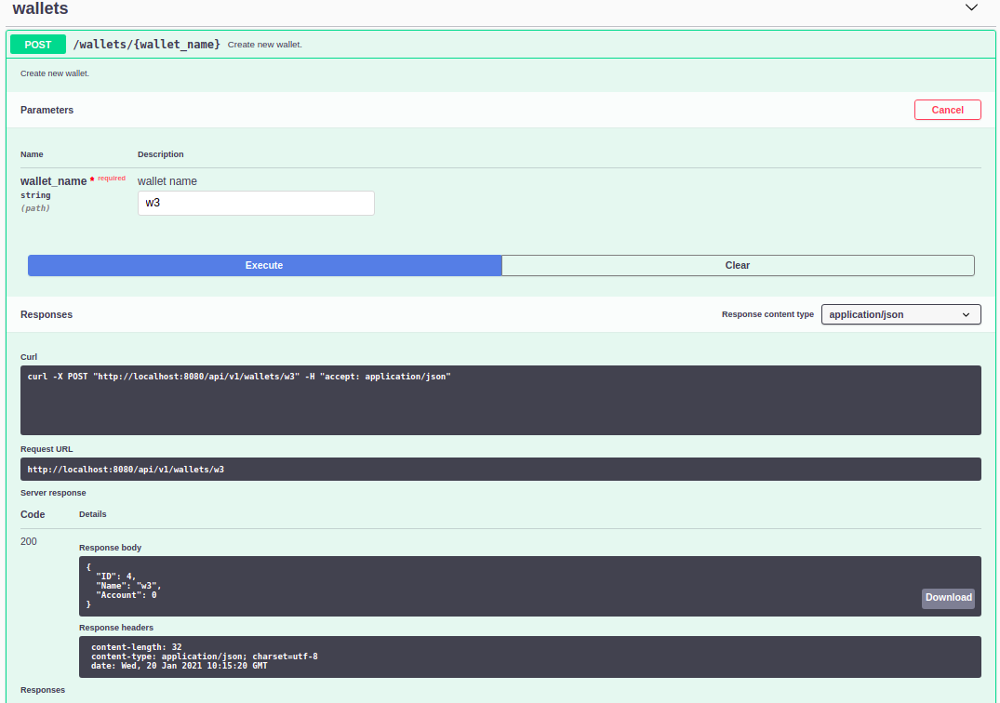
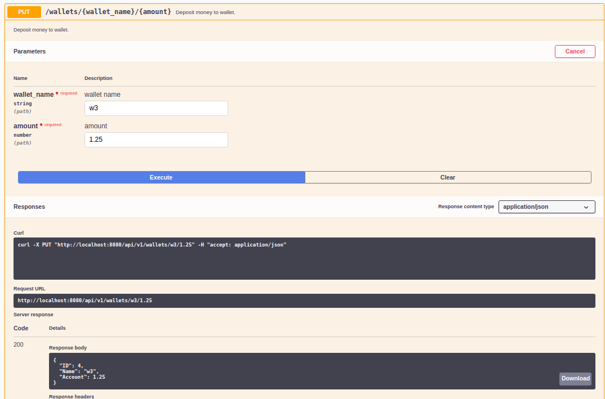
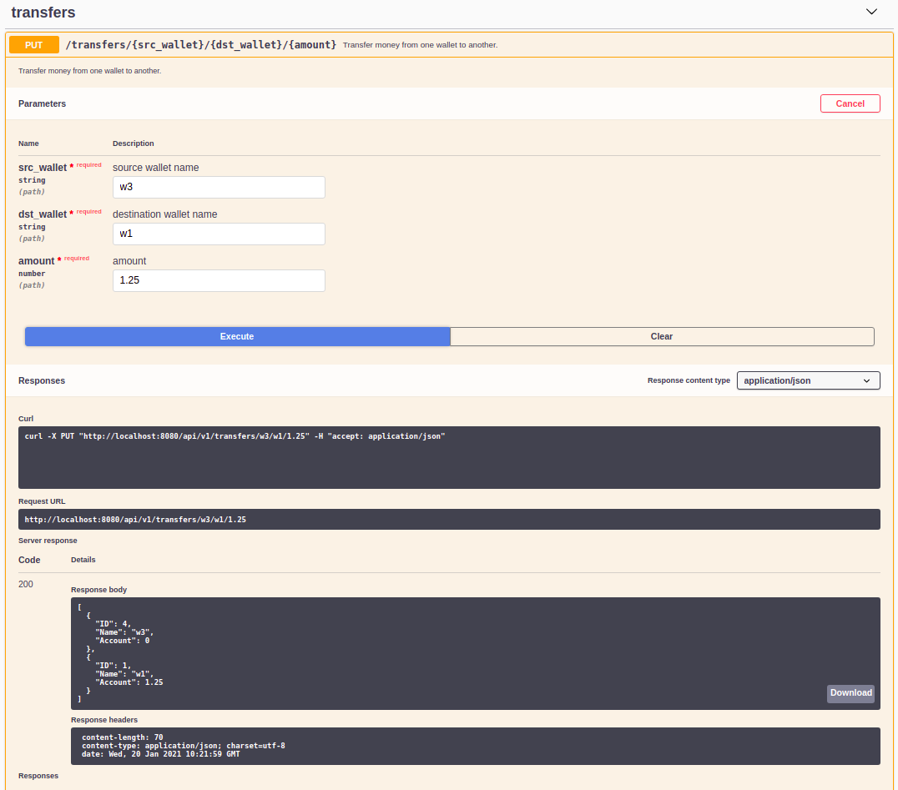
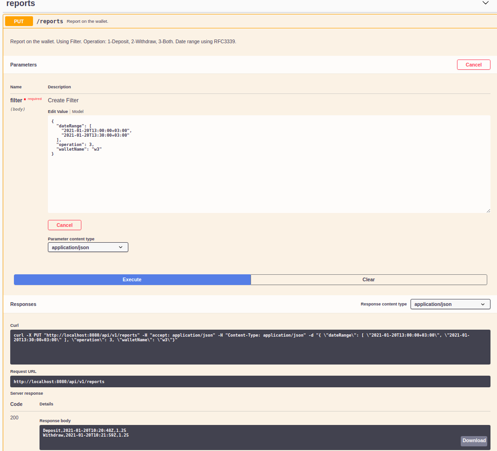
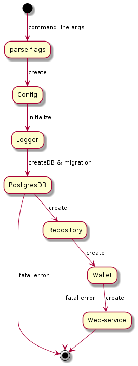

# Custom wallet

## Задание

Необходимо разработать платежную систему с пользовательскими кошельками.
Валюта сервиса - USD.

## Требования

1. Сервис предоставляет возможность добавить кошелек - каждый кошелек имеет
уникальное имя.

2. Клиенты могут делать друг другу денежные переводы в пределах баланса
кошелька, способ хранения баланса выбирается при реализации.

3. Сохраняется информация о всех операциях на кошельке клиента, ее можно
выгрузить по HTTP запросу,

4. Проект представляет из себя HTTP API, содержащее основные операции по
"кошелькам" и endpoint для отчетов.

5. HTTP API должен представлять следующие интерфейсы:
    - добавление кошелька
    - зачисление денежных средств на кошелек клиента
    - перевод денежных средств с одного кошелька на другой
    - выгрузка операций по кошельку с фильтрацией по дате проведения и
направлению операции (депозит, вывод), формат отчета csv

6. Сервис должен быть защищен от возможности задвоения операций, баланс
кошелька не должен быть отрицательным.

## Терминология

- __Wallet__ - пользовательский кошелек.
- __Transaction__ - операция со счетом.
- __Deposit__ - внести деньги на счет.
- __Withdraw__ - снять деньги со счета.
- __Transfer__ - перевести деньги с одного счета на другой.

## Use cases



## Структура приложения

### Бизнес-слой



Реализует use cases на уровне сервисов, которые требуют ТЗ. В бизнес-слое используются стандартные уровни:

- модель [model](./pkg/model)
- репозиторий [repo](./pkg/repo)
- сервис [service](./pkg/service).

В качестве базы данных задействована PostgreSQL. Для создания базы данных и миграции используется отдельный пакет [db](./pkg/db). Для миграции используются [scripts](./scripts).

### Web-сервер

Использует сервисы бизнес слоя для представления данных пользователю.



В качестве web-сервера используется [Gin Web Framework](https://github.com/gin-gonic/gin).
Дополнительно сделан декоратор __Graceful shutdown__ [graceful.go](./pkg/api/graceful.go) для корректной остановки сервера по сигналам ОС.

К серверу добавлен пакет [gin-swagger](https://github.com/swaggo/gin-swagger), который позволяет автоматически генерировать REST API и работать с сервисами приложения из браузера [swagger](http://localhost:8080/swagger/index.html).

Также можно генерировать документацию, исходя из кода с помощью команды в корневом каталоге:

```sh
make swag
```

Документация представлена в [swagger.json](./pkg/api/docs/swagger.json) и [swagger.yaml](./pkg/api/docs/swagger.yaml) swagger-форматах, и может экспортироваться в сторонние приложения.

#### Создание кошелька



#### Депозит



### Перевод



### Отчет



Для создания отчета заполняется предварительно [filter](./pkg/model/filter.go).
Используется диапазон дат. Даты требуется вводить в формате __RFC3339__.
Тип операции берется из списка [operation](./pkg/model/operation.go):

1-Deposit

2-Withdraw

3-Both

### Инициализация приложения



Посмотреть документацию кода можно с помощью [__godoc__](https://godoc.org/golang.org/x/tools/cmd/godoc).
Для запуска необходимо выполнить команду:

```sh
make godoc
```

Затем перейти по ссылке [docs](http://localhost:6060/src/custom-wallet/).

### Деплой приложения

С помощью [docker-compose](docker-compose.yml) можно запустить приложение и PosgreSQL-сервер в контейнерах. Для этого необходимо вызвать в корневой директории команду:

```sh
make docker
```

Также для запуска приложения при запущенной PosgreSQL по адресу __localhost:5432__, можно воспользоваться командой:

```sh
make run
```

Однако, если настройки окружения нестандартные, то необходимо запуск приложения сконфигурировать с помощью флагов командной строки:

```sh
custom-wallet -h
A payment system that uses custom wallets.

Usage:
  custom-wallet [flags]

Flags:
  -a, --addr string     WEB-address (default ":8080")
  -d, --dbname string   DB name (default "wallet")
  -h, --help            help for custom-wallet
  -s, --host string     DB address (default "localhost")
  -l, --log             Default log to Console
  -n, --mon             Migration enabled (default true)
  -m, --mpath string    Migration path scripts (default "../../scripts/")
  -p, --pass string     DB password (default "postgres")
  -o, --port int        DB port (default 5432)
  -u, --user string     DB username  (default "postgres")

```
